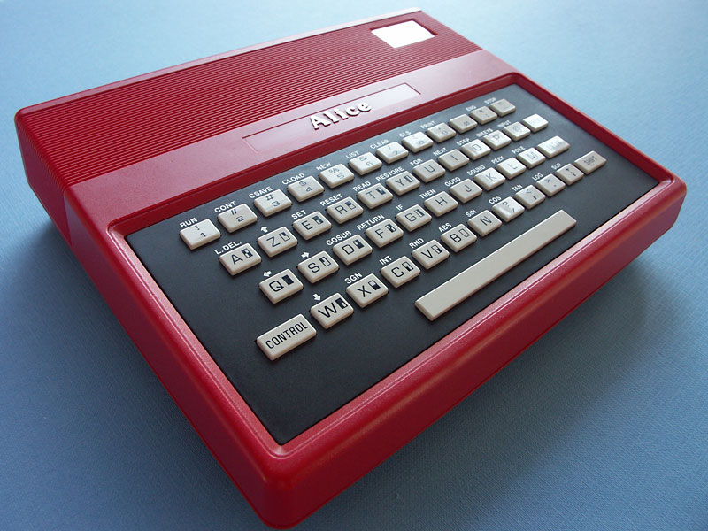

# Getting Started Guide for the Alice 4k and Alice 32



A French version of this document exists (more or less) on the system-cfg forum:
https://forum.system-cfg.com/viewtopic.php?f=27&t=12900

## Cables

Connections are described at: https://alice.system-cfg.com/hardware.php#connect

- This project might work as a way to force phones to detect a mic being connected if you want to create your own tape deck replacement cable: https://github.com/johnboiles/BaofengUV5R-TRRS

- The power supply is 9V AC (and I must stress **AC**, not a DC replacement supply) from an NES, or use a 12V 1A DC power supply (polarity doesn't matter). Serial won't work with a DC power supply.

## Software

You can download some software (originally linked from [Le Grenier Informatique](http://web.archive.org/web/20210306075300/http://www.le-grenier-informatique.fr/pages/les-telechargements/jeux.html)) by following this link:
[Pack 37 Jeux Alice.zip](data/Pack 37 Jeux Alice.zip)

It contains a number of Alice (and some MC-10) games as WAV files.

Depending on the hardware you have access to, you might want to instead use this video DVD as a player (look for *« Le DVD Alice »*):
https://alice.system-cfg.com/liens.php

On an unexpanded Alice 4K, you should be able to run:

```
Jouez avec Alice 2 - Le Mans, Squash.wav
Jouez avec Alice - Color-mind.wav
Jouez avec Alice - Mur de briques.wav
Jouez avec Alice - Sous-marin.wav
La caverne des morlocks.wav
Loto.wav
[MC10]Lost World Pinball.wav
[MC10]Pac Man.wav
[MC10] Road Race.wav
Pendu.wav
Slalom.wav
```

If you invest in a memory expansion (whether the MCX-128 or the MCX-32 SD), you will also be able to play:
```
Annexion_FaceA.wav
Annexion_FaceB.wav
FlagonBird.wav
Jeu de dames.wav
```

Alice 32:
```
Galaxion.wav
La chenille infernale.wav
Le Sphinx d'Or.wav
Pillage cosmique.wav
Plan de vol (Version ALICE32).wav
```

Alice 32 + memory expansion:
```
Al'Berthe.wav
Casse-Tête dans le Métro.wav
Coloric.wav
Crocky.wav
Kangourou.wav
La Grenouille à m'Alice.wav
La Marelle.wav
Tank.wav
Une Affaire en Or.wav
World War 3.wav
```

Documentation and screenshots for all those games should also be visible on this website (which ships the games as .k7 software, playable with [DCALICEK7](http://alice32.free.fr/emulateur/index.html), if needed):
http://alice32.free.fr/programmes/

## Testing tape

- `CLOAD` loads a BASIC program from tape
- `RUN` to launch BASIC program
- `CLOADM` loads an assembler program from tape
- `EXEC` to launch assembler program

## Testing video

`CLS` n will clear the screen while setting a colour. Interesting colours are:

- `1`: Black
- `2`: Green
- `3`: Blue
- `4`: Red
- `5`: White

## Testing audio

`SOUND n1, n2` will play a sound of intensity `n1/255` for `n2/13` seconds.

Try `SOUND 50, 55`.

## Compatibility

- Alice 4K is compatible with Tandy MC-10
- Alice 4K BASIC should be compatible with Alice 32 BASIC
- Alice 4K assembler software is not compatible with Alice 32

## Other resources

- [Alice Wiki](https://alice.system-cfg.com/)
